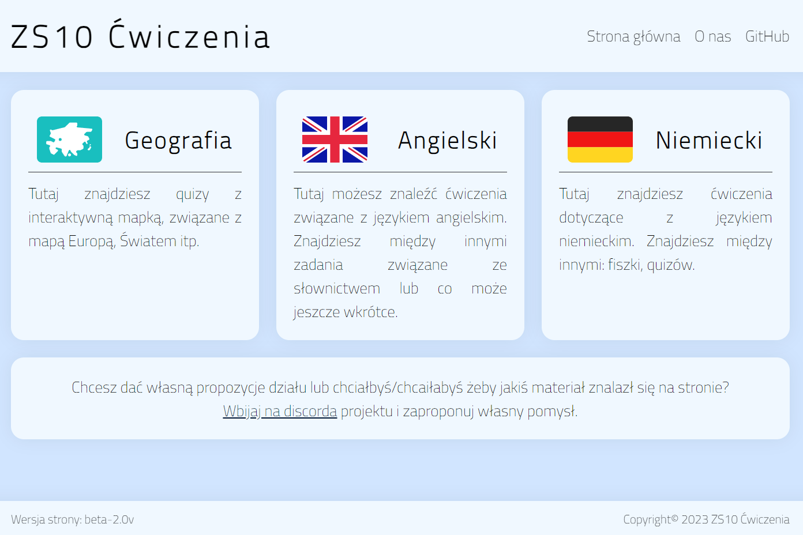
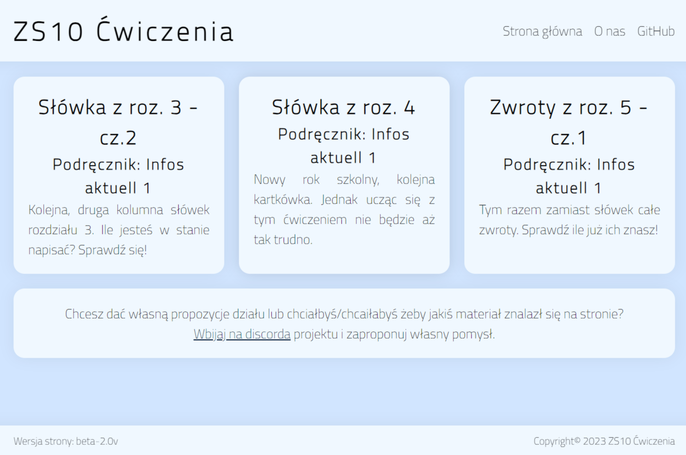
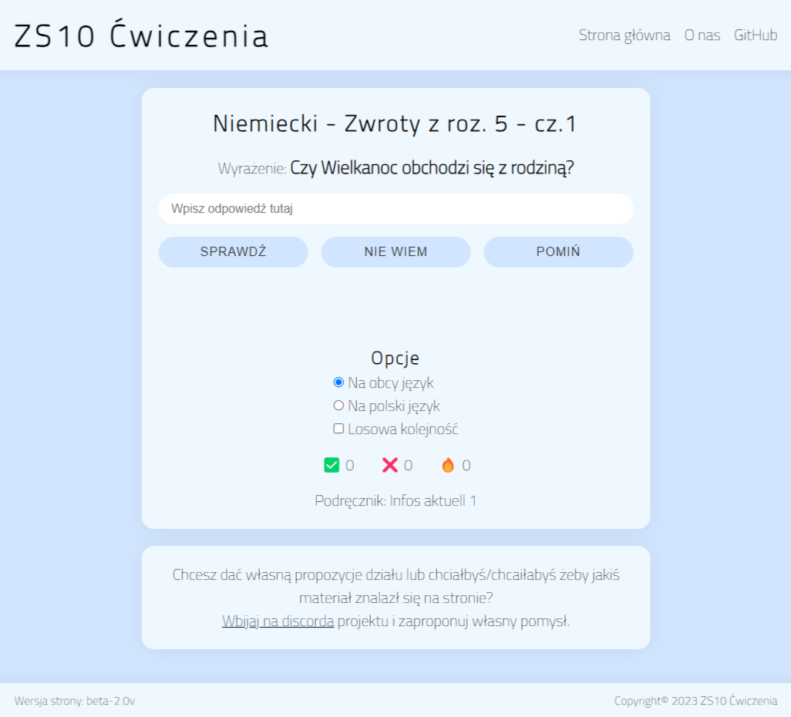

# ZS10 Ćwiczenia

ZS10 Exercises is a project carried out by 3 students attending ZS10 in Zabrze, majoring in Programming Technology. 
The application aims to learn by performing available exercises. You will find more about us below.

## Authors

- Karol Kopczyński - [@KarixD2137](https://github.com/KarixD2137)
- Cyprian Moj - [@cypekdev](https://github.com/cypekdev)
- Paweł Wasilewski - [@Pawel-Wasilewski](https://github.com/Pawel-Wasilewski)

## Demo

[https://test-zs10cwiczenia.ct8.pl](https://test-zs10cwiczenia.ct8.pl)

## Available types of exercises

- **Translations** - the user must translate the sentences into the specified language
- **Map** - the user must click on the appropriate area on the map
- **Irregular translations** - the user must translate and conjugate irregular verbs in foreign language

## Screenshots

## Feedback

If you have any feedback, please contact us on [our discord server](https://discord.gg/bDKD9GrTuX)

## Support

For support, [join our discord server](https://discord.gg/bDKD9GrTuX).

## Changelog

Information about changes [goes here](./CHANGELOG.md)

## Tech Stack

**Client:** Vanilla JavaScript, CSS, HTML

**Server:** PHP, MySQL

&nbsp;
&nbsp;

*README by [@cypekdev](https://github.com/cypekdev)*
